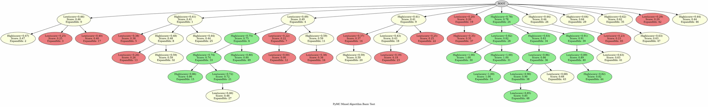

# Performance Investigation of `ask_batch` method
Here, we report the profiling result of `ask_batch` with different `batch_size`. As we can see, as we increase `batch_size`, AB-MCTS run is accelerated, while the search tree shape gets more skewed.

## Profiling Details

```bash
hyperfine \
  'uv run tests/profiling/ab_mcts_m.py -b 1' \
  'uv run tests/profiling/ab_mcts_m.py -b 2' \
  'uv run tests/profiling/ab_mcts_m.py -b 5' \
  'uv run tests/profiling/ab_mcts_m.py -b 10' \
  -w 0 -r 3 --export-markdown tests/profiling/benchmark.md
```

## Profiling Result
| Command | Mean [s] | Min [s] | Max [s] | Relative |
|:---|---:|---:|---:|---:|
| `uv run tests/profiling/ab_mcts_m.py -b 1` | 372.156 ± 37.808 | 342.916 | 414.852 | 6.98 ± 0.72 |
| `uv run tests/profiling/ab_mcts_m.py -b 2` | 202.324 ± 8.006 | 194.178 | 210.182 | 3.80 ± 0.16 |
| `uv run tests/profiling/ab_mcts_m.py -b 5` | 91.418 ± 2.391 | 90.026 | 94.179 | 1.71 ± 0.05 |
| `uv run tests/profiling/ab_mcts_m.py -b 10` | 53.307 ± 0.747 | 52.468 | 53.902 | 1.00 |

We note that different batch size leads to different tree shape; The larger batch size generates wider search tree.

### `batch_size=1`


### `batch_size=2`

### `batch_size=5`

### `batch_size=10`
